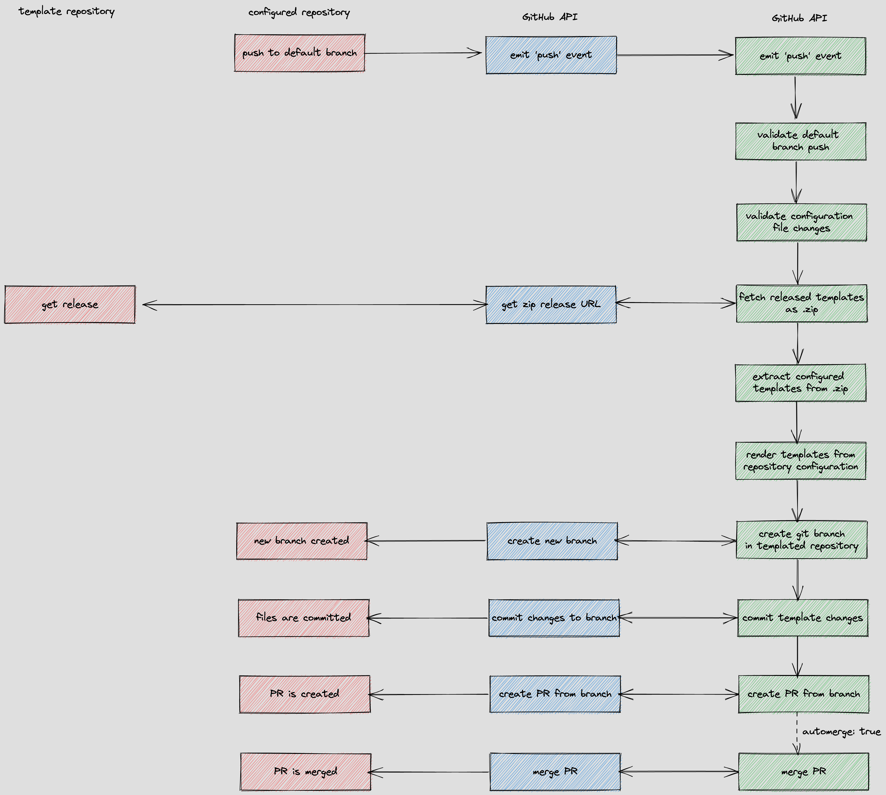

# Implementation Overview

## GitHub Webhooks
GitHub Apps can listen to webhooks being emitted based on what's happening in the organisation they're installed into. These webhook events are configured in the organisation page in GitHub. 

This app depends on one event type: `push`. The app subscribed to all `push` events happening on any repository within the organisation and will determine what to do based on the even `payload`. 

## Flow
The app will continue execution if the `push` event happens on any of the configured branches to listen for changes on. If the `push` event happened on any of these branches, the file changes in the given commit leading to the `push` event being emitted are examined. 

If any changes were made to the `<repository-name>.yaml` file found in a repository, then app will begin adding templates to the repository based on the changed configuration.

A template repository containing templates to add to repositories can be configured in the app. Once a repository configuration is picked up its contents are parsed and the configured templates are extracted from the template repository.

The extraction of templates from the template repository happens via GitHub releases. If a specific release version of the templates repository is configured within the configuration of a repository, that specific release is extracted for use. If no template release version is configured, then the most recent release of the template repository is used. 

### Templates
Templates are downloaded from a release of the template repository. Releases are downloaded from GitHub as a zip file. If the app is authorized to read private template repositories, a download link is generated and the release is downloaded through that link. This means that visibility settings do not prevent the app from templating private repositories. 

Templates are extracted from the downloaded ZIP file and any template paths configured in the repository configuration are extracted from the ZIP. Templates are formatted using [mustache](https://mustache.github.io/). 

Once the Mustache templates have been rendered with relevant configuration from the repository, they are committed to a new branch which is checked out from the current state of the default branch of the templated repository. A PR is then submitted to the templated repository with a request to merge the branch containing the template changes into the default branch. If `automerge` is enabled in the repository configuration, the app will attempt to merge the PR into the default branch automatically.

---

A simplified version of the app flow can be seen below. This shows how the template repository, configured repository, GitHub API and the app interact.

